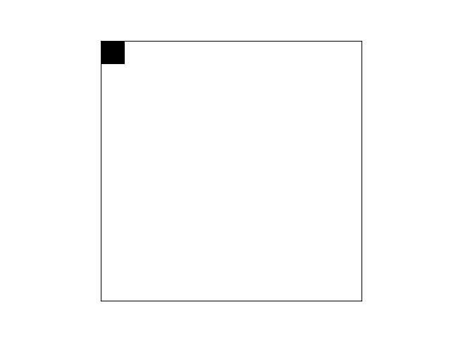

# maze_generation
A bit of a play around with different algorithms used to generate random mazes.

## Binary Tree Algorithm

This algorithm is very simple, but has the advantage of generating a perfect (in other words, solvable) maze without keeping any state.

In each iteration, for each existing cell in the grid (1) check if the neighbours above or to the left of the given cell exist (2) randomly choose to "connect" between one of these two neighbours. This can be seen, frame by frame, below.

